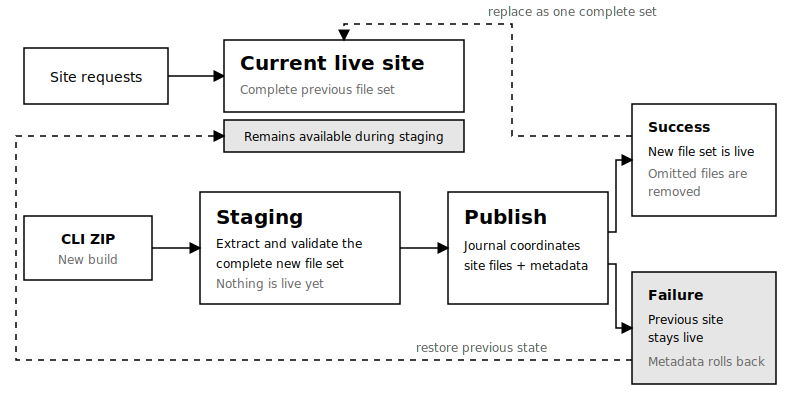

Use this guide when you need archive selection and replacement details beyond your [first deployment](../../getting-started/deploy-your-first-site/). Buzz publishes the contents of the selected directory, not the directory itself.

## Prerequisites

Complete [Deploy Your First Site](../../getting-started/deploy-your-first-site/) and build the files you want to publish into `./dist`.

The CLI includes dotfiles, but excludes these paths from the archive:

- `.git`
- `node_modules`
- `.vscode`
- `.idea`
- `.DS_Store` files
- `.env` and `.env.*` files

Keep `index.html` at the root of `./dist` when it should serve at the root site URL. The CLI uploads regular build output from the directory and the server validates the resulting ZIP archive before publishing it.

## Replace A Site

Deploy the new build with the same site name:

```bash
buzz deploy ./dist --subdomain my-site
```

A successful redeployment replaces the complete previous file set. Files omitted from the new build are removed from the hosted site. If validation or publishing fails, Buzz leaves the previous deployment in place.



Only the owner can replace a site. A deployment token can replace only the site to which it is scoped.

## Inspect The Deployment

Show the site URL stored for the current project:

```bash
buzz url
```

List the sites owned by the signed-in user:

```bash
buzz list
```

For naming behavior, read [Choose A Site Name](../choose-a-site-name/). For automation, read [Automate Deployments](../automate-deployments/).
